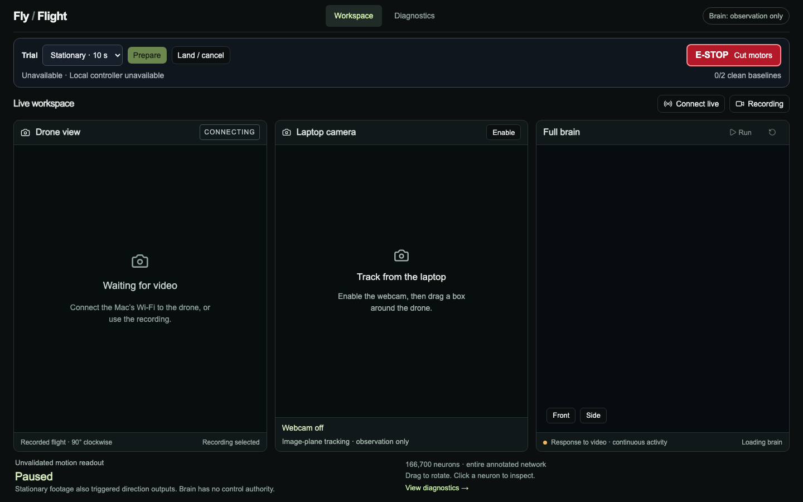
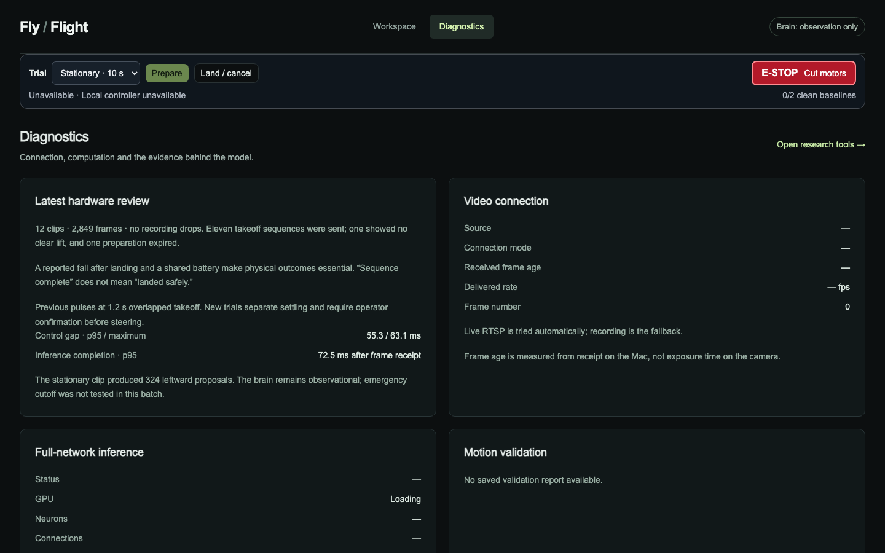
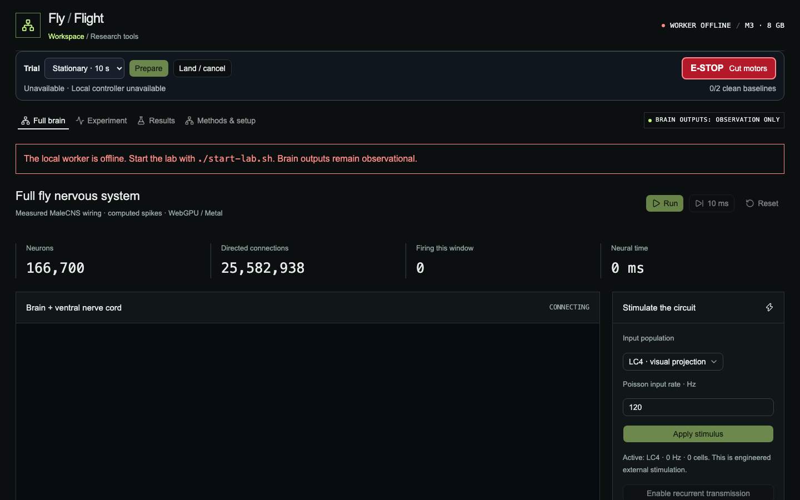
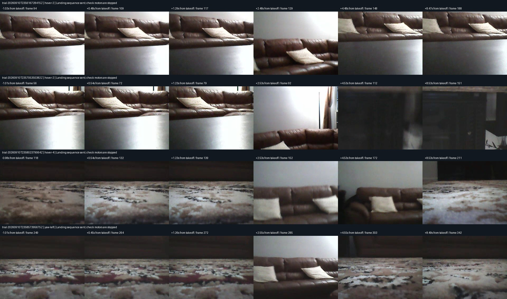
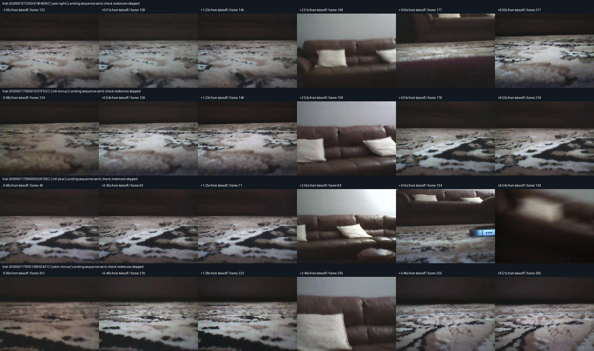
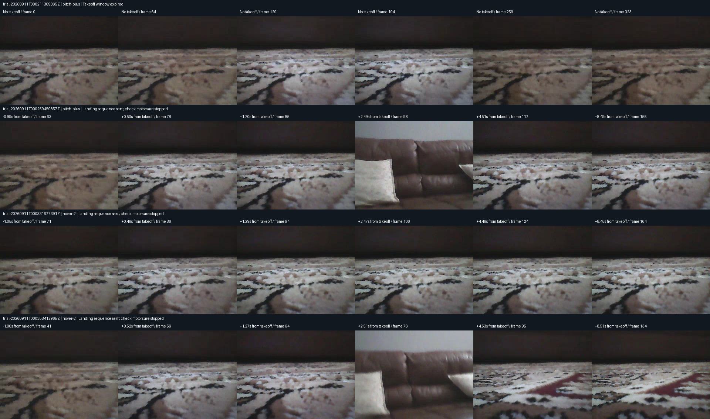
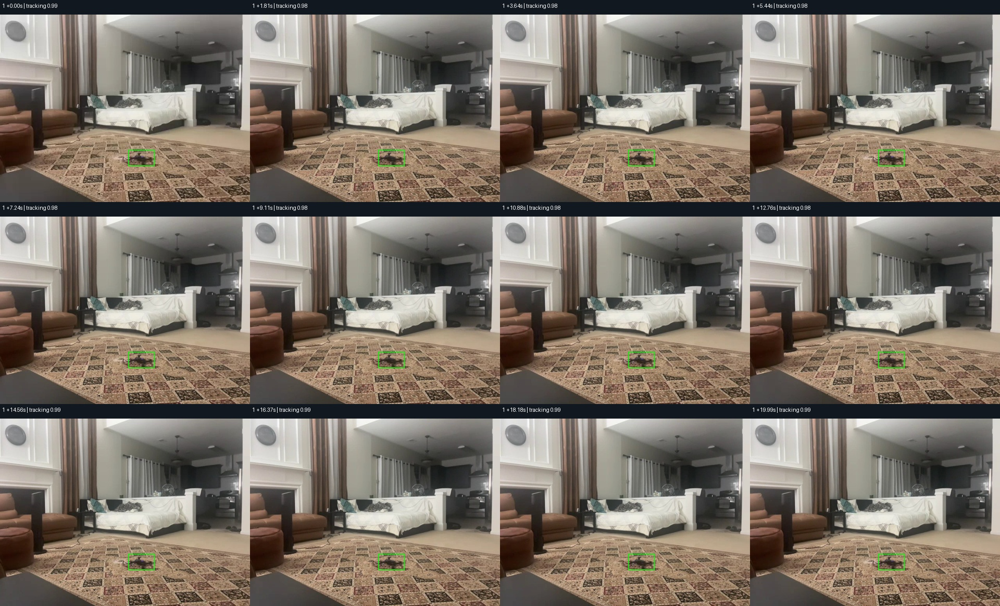
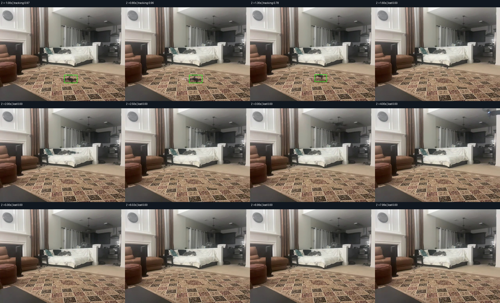

# flyByWire — Fly / Flight

**In plain terms:** this is a Mac app that shows a cheap Wi-Fi toy drone’s camera next to a live map of a real fruit fly’s brain. As the camera moves, parts of that brain light up. You can take off and land with big supervised controls (and a red E-STOP), but the brain only *watches* — it does not steer the drone yet. The long-term question is whether a real fly wiring diagram helps a small aircraft explore a room better than a made-up network of the same size.

Local connectome desk for an M-series Mac and a Wi-Fi RC UFO drone (MaleCNS on Metal, supervised takeoff/land, brain observation-only).



*Workspace: onboard video, laptop tracker, full-brain activity. E-STOP always available.*

## Quick start

```sh
./start-lab.sh
```

Open http://localhost:3000/ · worker on http://127.0.0.1:8766 · logs in `.lab-logs/`.

### First-time setup

```sh
python3 -m venv .venv
.venv/bin/python -m pip install -r requirements.txt
(cd ui && npm ci)
.venv/bin/python -m lab.download
.venv/bin/python -m lab.prepare
.venv/bin/python -m lab.prepare_full
.venv/bin/python -m lab.full_vision
```

Needs Python 3.14+, Node ≥22.13, FFmpeg, and a Metal/WebGPU adapter. MaleCNS download ≈ 1.1 GB.

### Checks

```sh
.venv/bin/python -m unittest lab.test_core lab.test_full_engine -v
(cd ui && npx tsc --noEmit && npm run lint:lab && npm run build)
```

## What’s in this repo

```
flyByWire/
  README.md           # you are here
  start-lab.sh        # starts worker + UI
  requirements.txt    # Python deps
  lab/                # backend (FastAPI worker, engines, flight runner, tests)
  ui/                 # frontend (vinext / React)
  scripts/            # probes + historical flight_trial.py
  docs/
    screenshots/      # UI + flight/external images
    benchmarks/       # backend/vision measurement writeups
    reviews/          # supervised flight & tracker review notes
    research/         # literature survey excerpts
  data/               # MaleCNS artifacts (mostly local; see data/README.md)
```

**Kept on disk, not committed:** `recordings/` (all flight clips), `experiments/` (run outputs), `diagnostics/`, `.venv/`, `ui/node_modules/`.

| Path | Role |
|---|---|
| `lab/` | Connectome engines, workspace API, supervised flight process |
| `ui/` | Workspace / Diagnostics / Research tools |
| `scripts/probe_*.py` | Network/camera/telemetry checks (no motor commands) |
| `scripts/flight_trial.py` | Older standalone takeoff/land script — don’t run beside the dashboard |
| `docs/reviews/` | Human-readable flight & external-tracking reviews |
| `docs/benchmarks/` | GPU/CPU decision, vision validation notes |

## Screenshots

### Workspace


### Diagnostics


### Research tools


### Flight contact sheets




### External tracking



## How it fits together

```
Camera (live RTSP or recording) ──► visual encoder ──► full MaleCNS graph (GPU)
                                              │
                                              ├── UI brain view (observe only)
                                              └── logged motion proposals (no motors)

Supervised flight process ──UDP :7099──► drone (TC packets)
  browser/video/recorder leases · land · E-STOP
```

- Workspace/brain cannot command motors (`lab/workspace.py`).
- Flight is a separate process (`lab/flight_runner.py`) with watchdogs.
- Laptop webcam tracker is observation-only (`docs/reviews/external-review-20260911.md`).

## Drone protocol (this hardware)

- Wi-Fi AP ≈ `192.168.1.1` · RTSP `rtsp://192.168.1.1:7070/webcam` (UDP MJPEG) · commands UDP **7099**.
- **TC** 9-byte packets (axes center 128): takeoff `01`, land `02`, emergency `04`.
- Verified on SSID `WIFI-UFO-e48414`: video, takeoff/land, dual cameras, clockwise video rotation.
- Control cadence measured ≈ 18.5 Hz (target 20). **E-stop not physically proven.**

Probes: `python3 scripts/probe_drone.py` (and `probe_cameras.py`, `probe_telemetry.py`).

## Supervised flight (v2)

1. Floor area with drift room.
2. Stationary 10 s (motors off).
3. Two clean operator-confirmed neutral baselines unlock axis pulses.
4. Pulse only after stable-hover confirmation; auto-land otherwise.
5. Log outcome in the UI; confirm motors stopped.

Details: `docs/reviews/flight-review-20260911.md`.

## Brain & research

- Full annotated MaleCNS: 166,700 neurons · 25,582,938 connections · Metal/WebGPU.
- Approximate dynamics (not a biological mind). License notes in `lab/licenses/`.
- Graded model powers the default workspace; spiking viewer lives under Research tools.
- Validation gates & vision notes: `docs/benchmarks/` · survey: `docs/research/review-20260910/`.

Offline experiments (pause the interactive GPU brain first):

```sh
.venv/bin/python -m lab.validate_full --batches 50
.venv/bin/python -m lab.scene_validation
```

## Safety

- Always supervise. Prefer floor launches after the table fall.
- E-STOP is best-effort software until proven on hardware.
- Closing the supervising UI should land via lease expiry — still watch the motors.
- Do not test link-loss by killing Wi-Fi mid unrestricted flight.

## Attribution

- [MaleCNS](https://male-cns.janelia.org/download/) CC BY 4.0
- [Neural Canvas](https://huggingface.co/spaces/Xenova/fruit-fly-simulation) MIT (spiking shader lineage)
- DOOMFLY / related demos — methodology contrast; independent implementation
